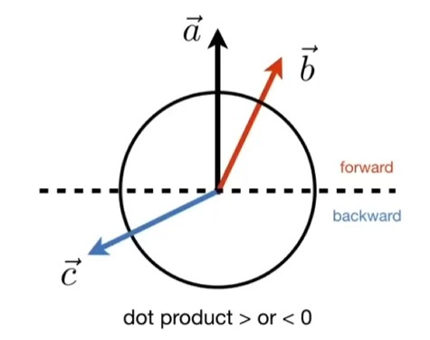
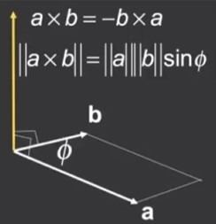
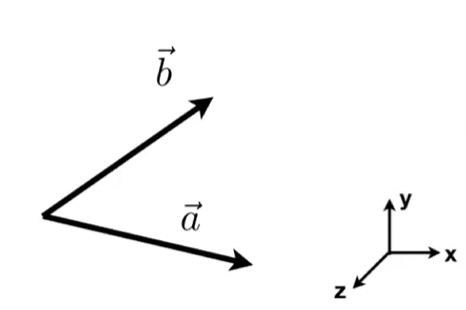
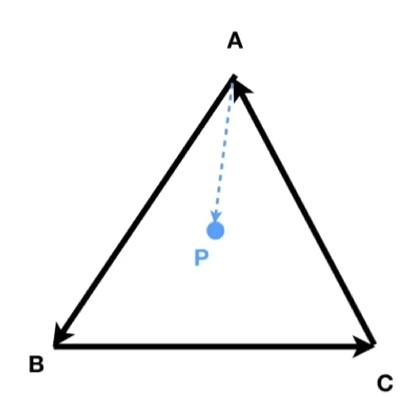
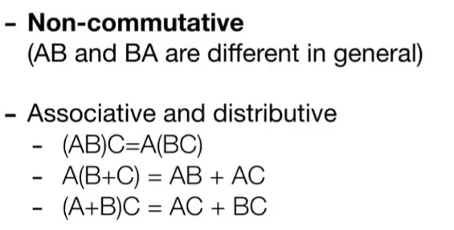
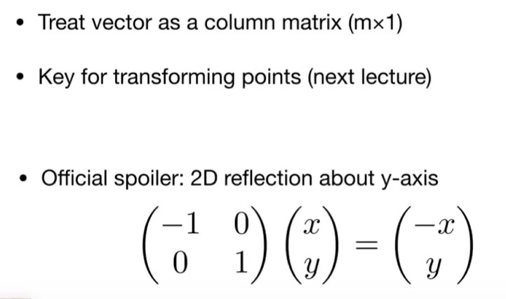
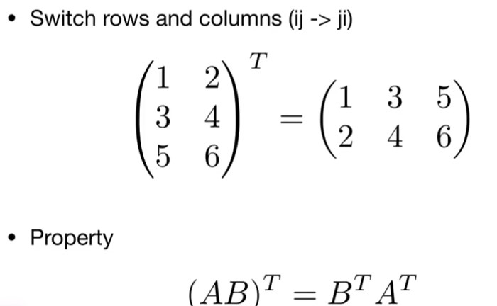
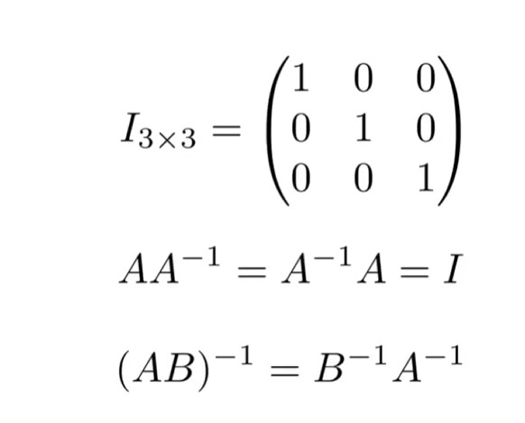

# Lecture02 Review of Linear Algebra 
 
## 向量的点积 Dot prodct
$$
\vec{a} \cdot \vec{b} = \|\vec{a}\| \|\vec{b}\| \cos \theta
$$ 
 
$$
\cos \theta = \frac{\vec{a} \cdot \vec{b}}{\|\vec{a}\| \|\vec{b}\|}
$$

对于**单位向量**（$\hat{a}$、$\hat{b}$ 为单位向量，即 $\|\hat{a}\|=1$、$\|\hat{b}\|=1$），夹角余弦可简化为：  

$$
\cos \theta = \hat{a} \cdot \hat{b}
$$

### 向量点积的运算律

  - **交换律**：  
    $$
    \vec{a} \cdot \vec{b} = \vec{b} \cdot \vec{a}
    $$

  - **分配律**：  
    $$
    \vec{a} \cdot (\vec{b} + \vec{c}) = \vec{a} \cdot \vec{b} + \vec{a} \cdot \vec{c}
    $$

  - **数乘结合律**：  
  $$
  (k\vec{a}) \cdot \vec{b} = \vec{a} \cdot (k\vec{b}) = k(\vec{a} \cdot \vec{b})
  $$

  ---
    
  **In 2D**  
    $$
    \vec{a} \cdot \vec{b} = \begin{pmatrix} x_a \\ y_a \end{pmatrix} \cdot \begin{pmatrix} x_b \\ y_b \end{pmatrix} = x_a x_b + y_a y_b
    $$
  **In 3D**  
    $$
    \vec{a} \cdot \vec{b} = \begin{pmatrix} x_a \\ y_a \\ z_a \end{pmatrix} \cdot \begin{pmatrix} x_b \\ y_b \\ z_b \end{pmatrix} = x_a x_b + y_a y_b + z_a z_b
    $$
     

  &emsp;&emsp;向量的点积运算可以理解为**向量a在向量b上的投影长度**乘以**向量b的长度**，即：$\vec{a} \cdot \vec{b} = \|\vec{a}\| \|\vec{b}\| \cos \theta$

{ align=right }

向量的点乘可以判断向量前与后的信息：   

- 如果点积为正，说明向量a在向量b的方向上;
- 如果点积为负，说明向量a在向量b的方向上；
- 如果点积为0，说明向量a与向量b正交。    

## 向量的叉积 Cross product
{ align=right }

- 叉乘的结果向量与参与叉乘的两个初始向量都**正交**（即垂直）
- 叉乘结果向量的方向由**右手定则**来确定
- 叉乘在**构建坐标系**的过程中很有用
  
**右手螺旋定则**：四指的方向是向量旋转的方向，拇指的方向是结果向量的方向     

**要注意，向量的叉积得到的结果永远是一个向量，而向量的长度可以是0**

在右手坐标系中：
$$
\vec{x} \times \vec{y} = +\vec{z}
$$
在左手坐标系中：
$$
\vec{y} \times \vec{x} = -\vec{z}
$$
### 向量叉积的运算律

$$\vec{a} \times \vec{b} = -\vec{b} \times \vec{a}$$

$$\vec{a} \times \vec{a} = \vec{0}$$

$$\vec{a} \times (\vec{b} + \vec{c}) = \vec{a} \times \vec{b} + \vec{a} \times \vec{c}$$

$$\vec{a} \times (k\vec{b}) = k(\vec{a} \times \vec{b})$$

(注意向量的叉乘没有**交换律**)

向量的叉积以代数的形式展示：

$$\vec{a} \times \vec{b} = \begin{pmatrix} y_a z_b - y_b z_a \\ z_a x_b - x_a z_b \\ x_a y_b - y_a x_b \end{pmatrix}$$

### 向量叉积在图形学中的作用

  **判断左和右**

   { width="300" }
   /// caption
   ///
  $\vec{a} \times \vec{b}$ 为正，说明向量a在向量b的左侧；为负，说明向量a在向量b的右侧。

  **判断内与外**
  { width="300" }
   /// caption
   ///
  - $\vec{AB}\times\vec{AP}> 0$   说明$P$在$\vec{AB}$左侧

  - $\vec{BC}\times\vec{BP}> 0$   说明$P$在$\vec{BC}$左侧

  - $\vec{CA}\times\vec{CP}> 0$   说明$P$在$\vec{CA}$左侧

 &emsp;**说明点P落在三角形ABC内部**(三角形绕向相反时，叉积都小于零时在内部)

 将任意一个向量分解到三个轴的方向上

$$\|\vec{u}\| = \|\vec{v}\| = \|\vec{w}\| = 1$$

$$\vec{u} \cdot \vec{v} = \vec{v} \cdot \vec{w} = \vec{u} \cdot \vec{w} = 0$$

$$\vec{w} = \vec{u} \times \vec{v} $$

$$\vec{p} = (\vec{p} \cdot \vec{u})\vec{u} + (\vec{p} \cdot \vec{v})\vec{v} + (\vec{p} \cdot \vec{w})\vec{w} \quad $$

## 矩阵 Martrices

### 矩阵的乘法

只有满足$(M \times N)(N \times P) = (M \times P)$才能进行矩阵乘法

$$
\begin{pmatrix}
1 & 3 \\
5 & 2 \\
0 & 4
\end{pmatrix}
\begin{pmatrix}
3 & 6 & 9 & 4 \\
2 & 7 & 8 & 3
\end{pmatrix}
=
\begin{pmatrix}
9 & ? & 33 & 13 \\
19 & 44 & 61 & 26 \\
8 & 28 & 32 & ?
\end{pmatrix}
$$

### 矩阵的性质
{ width="300" }

### 矩阵乘向量
{ width="300" }

### 矩阵的转置
{ width="300" }
**先调换再转置**

### 单位矩阵
{ width="300" }
/// caption
///

### 向量的点乘、叉乘（矩阵形式）
Dot product

$$
\begin{align*}
\vec{a} \cdot \vec{b} &= \vec{a}^T \vec{b} \\
&= \begin{pmatrix} x_a & y_a & z_a \end{pmatrix} \begin{pmatrix} x_b \\ y_b \\ z_b \end{pmatrix} \\
&= x_a x_b + y_a y_b + z_a z_b
\end{align*}
$$

Cross product

$$
\vec{a} \times \vec{b} = A^* b = \begin{pmatrix} 0 & -z_a & y_a \\ z_a & 0 & -x_a \\ -y_a & x_a & 0 \end{pmatrix} \begin{pmatrix} x_b \\ y_b \\ z_b \end{pmatrix}
$$