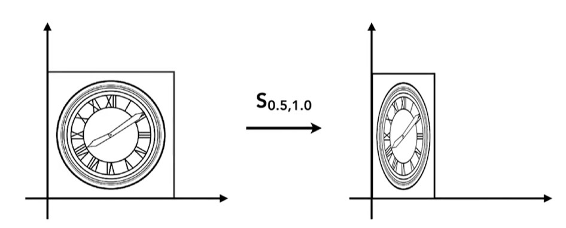
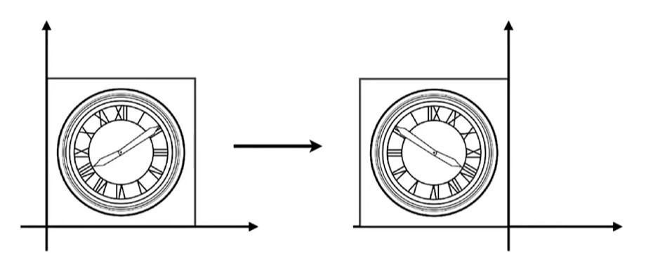
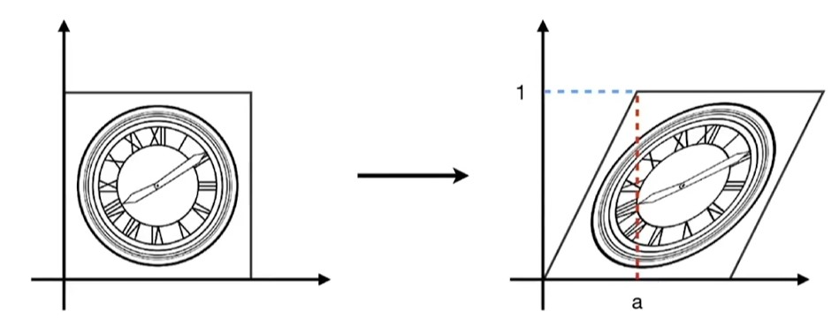
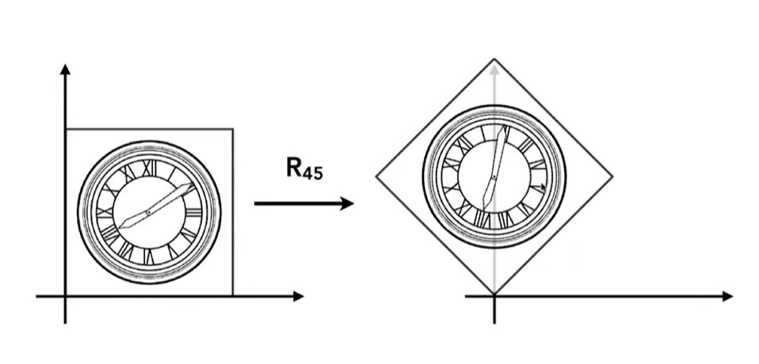
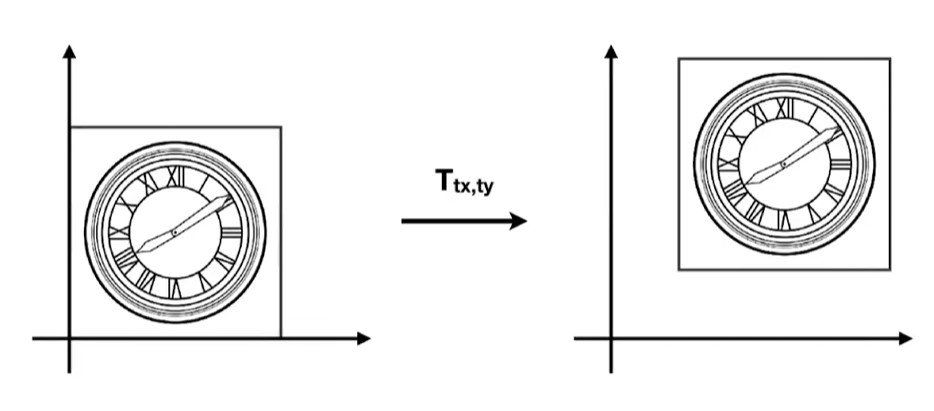
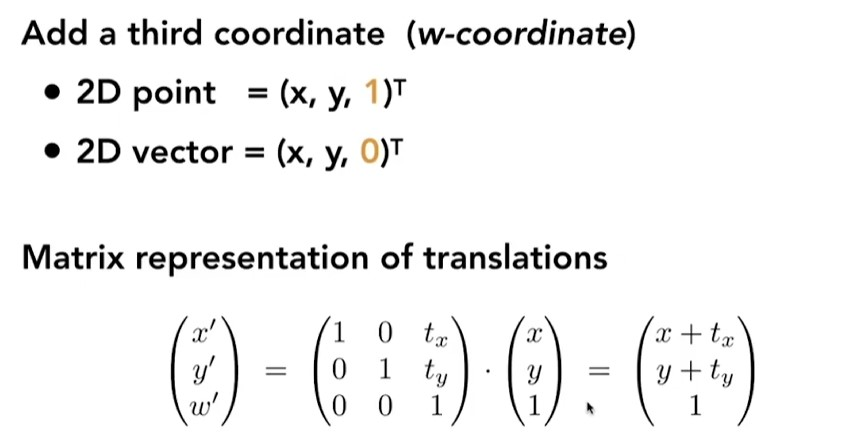
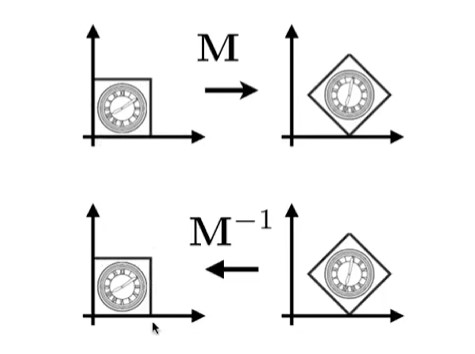
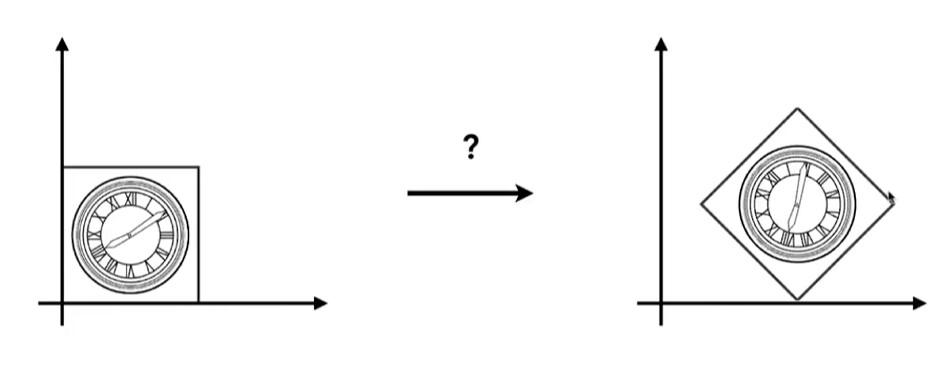
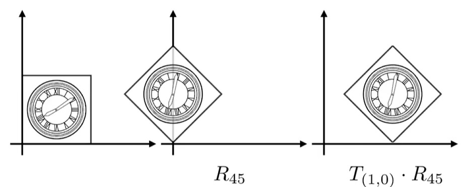
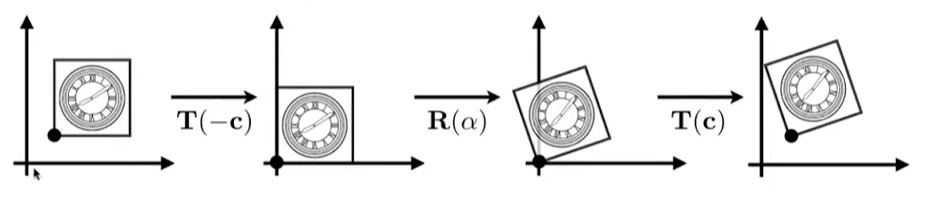

# Lecture03 and Lecture04 Transformations

## 2D Transformations(2D变换)

### 缩放变换

{ width="300" }
/// caption
///

$$
\begin{bmatrix} x' \\ y' \end{bmatrix} = \begin{bmatrix} s_x & 0 \\ 0 & s_y \end{bmatrix} \begin{bmatrix} x \\ y \end{bmatrix}
$$

### 翻转变换

{ width="300" }
/// caption
///

$$
\begin{bmatrix} x' \\ y' \end{bmatrix} = \begin{bmatrix} -1 & 0 \\ 0 & -1 \end{bmatrix} \begin{bmatrix} x \\ y \end{bmatrix}
$$

### 切变变换

{ width="300" }
/// caption
///

$$
\begin{bmatrix} x' \\ y' \end{bmatrix} = \begin{bmatrix} 1 & a \\ 0 & 1 \end{bmatrix} \begin{bmatrix} x \\ y \end{bmatrix}
$$

### 旋转变换(**默认为逆时针旋转**)

{ width="300" }
/// caption
///

- 设点 P(x, y) 的极坐标为 r、\(\varphi\)，即：\(x = r\cos\varphi,\ y = r\sin\varphi\)。
- 将点逆时针旋转角度 \(\theta\) 后，角度变为 \(\varphi + \theta\)。
- 因此坐标变换为：
  
  \(x' = r\cos(\varphi+\theta) = r(\cos\varphi\cos\theta - \sin\varphi\sin\theta) = x\cos\theta - y\sin\theta\)

  \(y' = r\sin(\varphi+\theta) = r(\sin\varphi\cos\theta + \cos\varphi\sin\theta) = x\sin\theta + y\cos\theta\)

- 写成矩阵形式：

$$
\begin{bmatrix} x' \\ y' \end{bmatrix} = \begin{bmatrix} \cos\theta & -\sin\theta \\ \sin\theta & \cos\theta \end{bmatrix} \begin{bmatrix} x \\ y \end{bmatrix}
$$

### **齐次坐标！！！**(homogeneous coordinate)

#### 为什么要引入齐次坐标？
{ width="300" }
/// caption
///

**无法简单的用矩阵的乘法来描述平移变换！！**

$$
\begin{bmatrix} x' \\ y' \end{bmatrix} = \begin{bmatrix} a & b \\ c & d \end{bmatrix} \begin{bmatrix} x \\ y \end{bmatrix} + \begin{bmatrix} t_x \\ t_y \end{bmatrix}
$$

所以引入齐次坐标，通过增加一个维度，将仿射变换（即平移、缩放、旋转、切变）统一为矩阵乘法表示。

{ width="300" }
/// caption
///

扩充的定义：

$$
\begin{bmatrix} x \\ y \\ w \end{bmatrix} \Rightarrow \begin{bmatrix} x/w \\ y/w \\ 1 \end{bmatrix},\quad w \ne 0
$$

#### 将齐次坐标应用于变换中
缩放变换中：

$$S(s_x, s_y) = \begin{bmatrix} s_x & 0 & 0 \\ 0 & s_y & 0 \\ 0 & 0 & 1 \end{bmatrix}$$

旋转变换中：

$$R(\alpha) = \begin{bmatrix} \cos\alpha & -\sin\alpha & 0 \\ \sin\alpha & \cos\alpha & 0 \\ 0 & 0 & 1 \end{bmatrix}$$

平移变换中：

$$T(t_x, t_y) = \begin{bmatrix} 1 & 0 & t_x \\ 0 & 1 & t_y \\ 0 & 0 & 1 \end{bmatrix}$$

### 逆变换
{ width="300" }
/// caption
(变换后再进行逆变换回到最初的位置)
///

先后进行矩阵M的变换和**矩阵M的逆**变换

### 变换的组合
复杂的变换可以通过一系列简单的变换得到：

{ width="300" }
/// caption
///

{ width="300" }
/// caption
可以通过先旋转后平移的方式得到
///

**变换的顺序不一样，结果也不一样，可以用就矩阵的乘法不满足交换律来理解**
**同时，矩阵的变换是从右到左依次应用的**

$$
A_n(\dots A_2(A_1(\mathbf{x}))) = A_n \cdots A_2 \, A_1 \begin{bmatrix} x \\ y \\ 1 \end{bmatrix}
$$

以上公式中，是先应用A_1变换，再应用A_2变换，最后应用A_n变换，也可以理解为，将所有变换结合，再应用于向量。

### 变换的分解
{ width="300" }
/// caption
///
如图，绕矩形左下角的点进行旋转的变换，可以分解为平移，旋转，再进行平移

## 3D Transformations(3D变换)

- 3D 点的齐次坐标：$(x, y, z, 1)^T$
- 3D 向量的齐次坐标：$(x, y, z, 0)^T$
- 一般情况：$(x, y, z, w)$（$w \ne 0$）对应的 3D 点为：$(x/w,\ y/w,\ z/w)$
  
经过线性变换和平移的矩阵表示为：

$$
\begin{bmatrix} x' \\ y' \\ z' \\ 1 \end{bmatrix} = \begin{bmatrix} a & b & c & t_x \\ d & e & f & t_y \\ g & h & i & t_z \\ 0 & 0 & 0 & 1 \end{bmatrix} \begin{bmatrix} x \\ y \\ z \\ 1 \end{bmatrix}
$$

缩放变换：

$$
S(s_x, s_y, s_z) = \begin{bmatrix} s_x & 0 & 0 & 0 \\ 0 & s_y & 0 & 0 \\ 0 & 0 & s_z & 0 \\ 0 & 0 & 0 & 1 \end{bmatrix}
$$

平移变换：

$$
T(t_x, t_y, t_z) = \begin{bmatrix} 1 & 0 & 0 & t_x \\ 0 & 1 & 0 & t_y \\ 0 & 0 & 1 & t_z \\ 0 & 0 & 0 & 1 \end{bmatrix}
$$

旋转变换：

绕x,y,z轴旋转：

$$R_x(\alpha)=\begin{bmatrix}
1 & 0 & 0 & 0 \\
0 & \cos\alpha & -\sin\alpha & 0 \\
0 & \sin\alpha & \cos\alpha & 0 \\
0 & 0 & 0 & 1
\end{bmatrix}$$

$$R_y(\alpha)=\begin{bmatrix}
\cos\alpha & 0 & \sin\alpha & 0 \\
0 & 1 & 0 & 0 \\
-\sin\alpha & 0 & \cos\alpha & 0 \\
0 & 0 & 0 & 1
\end{bmatrix}$$

$$R_z(\alpha)=\begin{bmatrix}
\cos\alpha & -\sin\alpha & 0 & 0 \\
\sin\alpha & \cos\alpha & 0 & 0 \\
0 & 0 & 1 & 0 \\
0 & 0 & 0 & 1
\end{bmatrix}$$

**在三维空间中，任何一个旋转都可以分解为绕x轴、y轴、z轴的旋转的组合**

$$R_{xyz}(\alpha,\beta,\gamma) = R_x(\alpha)\, R_y(\beta)\, R_z(\gamma)$$

罗德里格斯旋转公式：

$$
R(\mathbf{n}, \alpha)
= \cos\alpha\, I
+ (1-\cos\alpha)\,\mathbf{n}\mathbf{n}^\top
+ \sin\alpha\,
\begin{bmatrix}
0 & -n_z & n_y \\
n_z & 0 & -n_x \\
-n_y & n_x & 0
\end{bmatrix}
$$